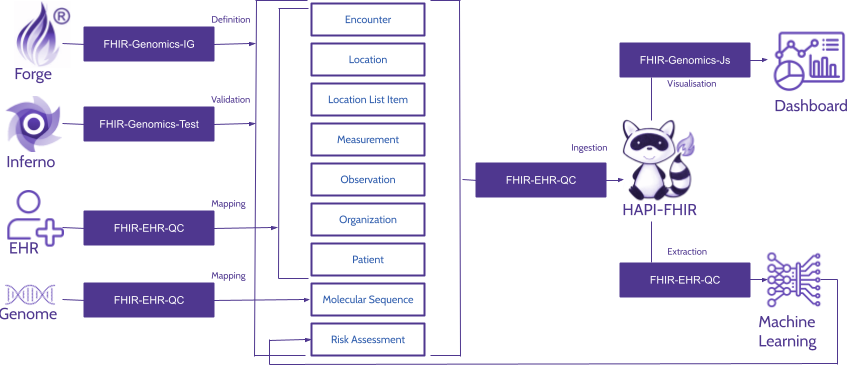
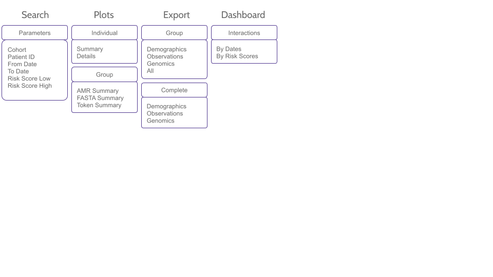

# Summary

To accurately model infectious diseases, it is essential to have an integrated representation that combines patient electronic health record (EHR) data with pathogen genomic information. To address this need, we introduce FHIR-EHR-QC, a comprehensive framework designed to facilitate the development of integrated data representations by leveraging Fast Healthcare Interoperability Resources (FHIR) platform (refer to Figure 1). It also offers user-friendly, interactive visualisations that enable ad-hoc exploratory analyses. The export functionality from the framework generates a harmonised data matrix, which can be readily used in multimodal machine learning workflows. To illustrate its utility, we applied the framework to real-world datasets to construct an integrated representation, which was subsequently employed to model the complex dynamics of infectious diseases using machine learning approaches.

Figure 1: Schematic overview of the FHIR-EHR-QC system, depicting the components involved in constructing and utilising the integrated representation. Biomedical information including patient records, associated genomic data, and risk scores is mapped into resources for ingestion into the FHIR server. These resources are created using the Forge utility and validated through FHIR Inferno. The integrated representation supports interactive dashboards for exploratory visualisation, while the extraction module enables the generation of a harmonised data matrix for downstream multimodal machine learning applications.

# Statement of Need

Infectious diseases arise from the invasion and colonisation of the host by pathogenic microorganisms. Their outcome is determined by a complex interplay between virulence capabilities of the pathogens and the host immune responses. Therefore, accurate modelling of infectious disease outcomes requires harmonised, high-resolution datasets that integrate both pathogen-specific genomic characteristics and host-specific responses. For this purpose, FHIR provides a robust platform that includes customisable templates, known as resources, to harmonise diverse biomedical entities such as patient health records and genomic sequencing artifacts. However, current approaches for ingesting data into FHIR demonstrate several limitations (see Table 1), which constrain their applicability for developing integrated representations within the FHIR framework. We developed FHIR-EHR-QC, a flexible data harmonization utility specifically designed to address the identified shortcomings.

| Framework/Tool                                  | FHIR Resources        | Transformations                         | Compatible with Version   | Ingestion from relational EHR |
|-------------------------------------------------|-----------------------|-----------------------------------------|---------------------------|-------------------------------|
| Google FhirProto                                | FhirProto based       | N/A                                     | All                       | No                            |
| OMOP CDM mapping to FHIR Resources by OHDSI     | Selected 10 entities  | FHIR <-> DB (OMOP)                      | OMOP-CDM v5, FHIR DTSU 2  | No                            |
| healthcare-data-harmonization                   | All                   | FHIR <-> DB                             | All                       | No                            |
| Mapping from openEHR to FHIR and OMOP-CDM       | Selected 6 tables     | DB (openEHR) -> FHIR and DB (OMOP CDM)  | OMOP-CDM v6.0, FHIR v4    | No                            |
| FHIR to OMOP FHIR IG                            | New profiles          | FHIR -> DB (OMOP)                       | OMOP-CDM v5.4             | No                            |
| Pathogene-on-FHIR                               | All                   | FHIR <-> DB                             | All                       | Yes                           |

Table 1: A comparative overview of various tools developed for ingesting data into FHIR. Each tool is evaluated across four key dimensions: the types of FHIR resources supported, the nature of data transformations enabled (e.g., FHIR to database or bidirectional mapping), version compatibility with OMOP-CDM and FHIR standards, and whether the tool supports ingestion of data directly from relational EHR systems. Notably, FHIR-EHR-QC supports all FHIR resources, and supports all FHIR and OMOP-CDM versions due to its flexible design. It performs the reverse data flow enabling bidirectional transformations. It can also support direct ingestion from relational EHRs—highlighting a current gap in integration workflows.

# Implementation

## The data ingestion and extraction utility

This utility, developed in Python (version 3.8), provides a command-line interface. It follows a flexible configurable design that allows for easy customisation and extension to adapt to any requirement. The utility uses the AppConfig file to obtain connection details for data hosts, including the FHIR server base URL and relational database server connection credentials. Additionally, by modifying the configuration file named RunConfig, users can build tailored workflows to suit their specific scenario. The file can contain multiple blocks, with each block representing a single module. Modules are executed sequentially in the order they appear in the configuration file, ensuring systematic processing of the entire workflow. The modules available within the FHIR-EHR-QC framework include:

### Genomics Integration Module

This module offers GTF-to-FHIR utility function for ingesting small genomic datasets into FHIR. Additionally, it also offers Genome-to-FHIR for large-scale data, storing only URLs in FHIR to optimise memory. The input can be in a GTF format or a CSV file with genomic annotations. For example, an index file with token locations genomicBERT model [@chen2023genomicbert] was used to ingest selected tokens into FHIR. Essentially, both functions require an index file mapping patients to the corresponding genomic data files. Additionally, they also require a file containing JSON template to generate FHIR resources.

### Health records integration Module

#### DB-to-FHIR

It consists of an utility to extract data from any relational database using user-defined SQL queries, maps it to the provided FHIR JSON template, and uploads it to a FHIR server.

#### FHIR-to-DB

It supports transfer of FHIR data to relational databases using FHIR URL queries and SQL insertion logic. Data is mapped via key-value pairs between extracted JSONPath and insertion field.

Both these utilities support OMOP-CDM by default, custom queries and templates enable support for non-standard schemas.

### Auxiliary features designed to streamline and support the construction of a seamless workflow

In addition to the aforementioned configurations, the utility offers further customisations applicable to all functionalities.

#### Intermediate data storage

One such feature enables the saving of intermediate data, controlled by a boolean flag indicating whether to save intermediate data as individual files and a tag specifying the save path. This functionality enables seamless pausing and resuming of data transfer at any point, facilitates debugging, and allows for the division of larger tasks into more manageable segments. The utility also stores failed data files separately which can be later used for debugging purposes. Moreover, the utility allows for granular workflow control, enabling the segmentation of the workflow into smaller, manageable parts. This is achieved through configurations that permit the separation of data fetching, saving, and ingestion into distinct processes.

#### Tailored workflows

A key feature of this module is its ability to incorporate custom code execution at any point in the workflow. This is achieved by specifying a function and its corresponding arguments within the RunConfig, interspersed with other configuration blocks. We used this feature for performing preprocessing operations to prepare data, and for obtaining data from external services. Essentially, the incorporation of custom code opens up a wide range of possibilities for users, allowing for tailored workflow customisation and enhanced functionality.

#### Incremental data loading

In addition to the bulk loading, FHIR-EHR-QC also supports the incremental data loading feature allowing the transfer of only modified data, reducing the data transfer volume. Specifically, incremental loading is achieved through altering the extraction logic such that only the newly inserted or updated information is extracted from the time-stamped data. Essentially, it enables efficient two-way data synchronisation and ensures data consistency across both systems.

#### Harmonised data export

The export functionality enables users to extract linked data from the FHIR server, providing a seamless interface for downstream applications. With this feature, Demographics, Measurements, Genomics, or all three of these entities can be exported as a data matrix. The export process is governed by selection criteria passed as parameters to the export function, allowing users to specify the records to include or exclude. These filtering parameters include patient name for partial matching, risk score ranges, and admission date ranges, enabling precise control over the exported data. Notably, the exported data is formatted to ensure direct compatibility with other utilities, facilitating automated clinical outcome modelling.

## Harnessing integrated data to generate insights

In addition to the data ingestion and extraction utility, we developed a web-based application, incorporating functionalities designed to support the effective use of integrated data representations. The application primarily provides data exploration and visualisation, along with additional supporting functionalities (see Figure 2). The search function retrieves the data records from a FHIR server based on the user specified criteria. Resulting records can be visualised either individually or at group level. Individual visualisations include the genomic summary plot offering a high-level overview of the genomic information and the detailed plots for much finer granularity. Group-level plots provide visualisations of the integrated data for all records matching the search criteria. These plots are categorised into AMR summary, FASTA summary, and Token summary, each with multiple interactive graphs. The search results can also be exported into flat files for subsequent analysis. The utility also offers interactive dashboards where users can control variables like risk score and admission date in real time to dynamically specify the data used for plotting.

Figure 2: An overview of the functionalities enabled by integrated data.

# Acknowledgments

ST acknowledge funding support of (??). YR received Monash Graduate Scholarship for his PhD. We acknowledge the FHIR and OMOP community for developing and providing this crucial data representation standards. We acknowledge the contributions of the developers of the open-source software utilized in this project, in particular Gosling, React, and Material UI, which were instrumental in the development of this framework. Lastly, we acknowledge the ARDC Nectar Research Cloud for providing computational resources for this project.

# References
